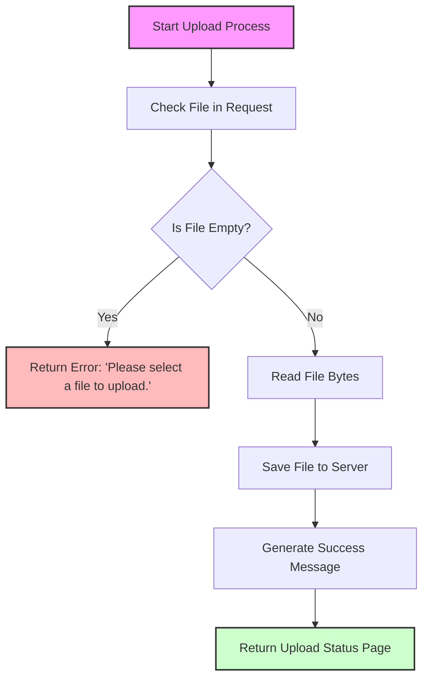
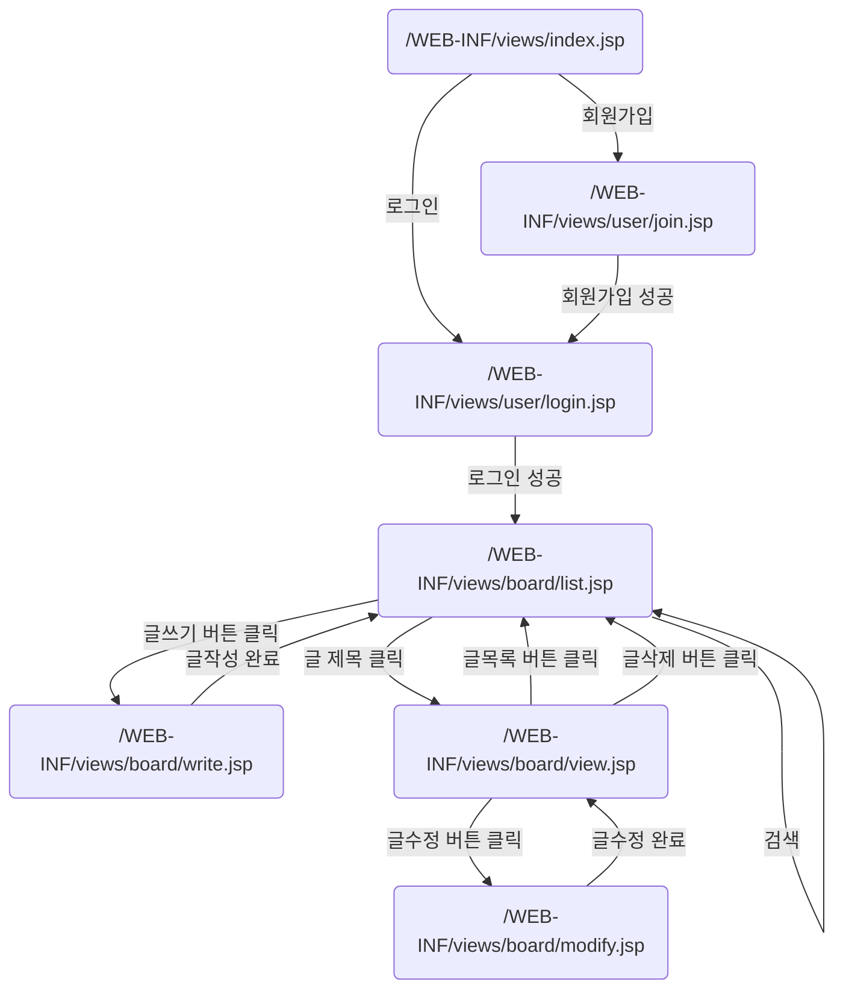
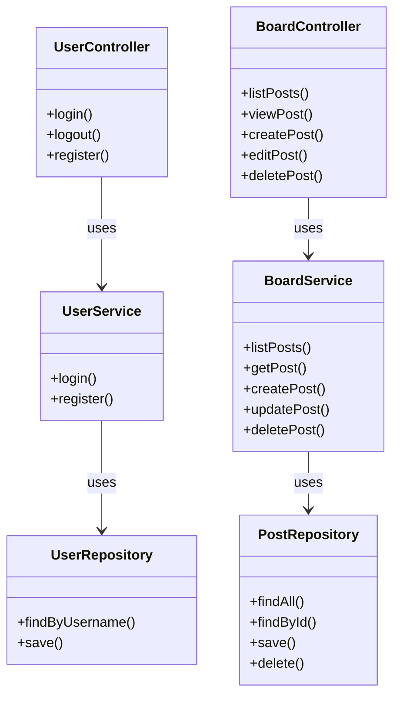
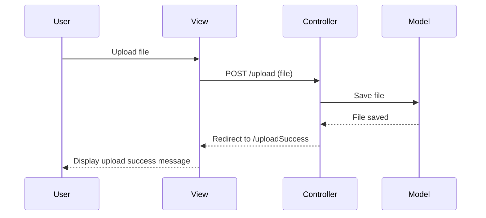

### 1. 의존성 추가
Spring Boot를 사용하는 경우, `spring-boot-starter-web` 의존성이 포함되어 있으면 기본적으로 파일 업로드를 지원합니다. 그러나 파일 업로드 크기 제한 등을 설정하기 위해 추가 설정이 필요할 수 있습니다. `spring-boot-starter-web`은 내부적으로 `spring-webmvc`와 `spring-web`을 포함합니다.

### 2. MultipartResolver 설정
파일 업로드를 처리하기 위해 Spring MVC 애플리케이션에 `MultipartResolver`를 구성해야 합니다. 이는 들어오는 요청을 분석하고 멀티파트 파일 데이터를 Spring의 `MultipartFile` 객체로 변환하는 역할을 합니다. `MultipartResolver`의 가장 일반적인 구현체는 `StandardServletMultipartResolver`입니다. Spring Boot를 사용하는 경우, 이는 자동으로 설정되지만, 명시적으로 구성할 수도 있습니다.

```java
@Bean
public MultipartResolver multipartResolver() {
    CommonsMultipartResolver multipartResolver = new CommonsMultipartResolver();
    multipartResolver.setMaxUploadSize(1000000); // 최대 업로드 사이즈 설정
    return multipartResolver;
}
```

### 3. application.properties 설정
Spring Boot에서는 `application.properties` 또는 `application.yml` 파일을 사용하여 파일 업로드와 관련된 속성을 쉽게 설정할 수 있습니다.

```properties
spring.servlet.multipart.max-file-size=2MB
spring.servlet.multipart.max-request-size=2MB
```

### 4. 컨트롤러 구현
파일을 업로드하는 컨트롤러를 구현합니다. `@PostMapping` 어노테이션을 사용하여 특정 경로에서 POST 요청을 처리하도록 설정하고, `MultipartFile` 파라미터를 사용하여 업로드된 파일을 받습니다.

```java
@PostMapping("/upload")
public String handleFileUpload(@RequestParam("file") MultipartFile file, RedirectAttributes redirectAttributes) {
    if (file.isEmpty()) {
        redirectAttributes.addFlashAttribute("message", "Please select a file to upload.");
        return "redirect:uploadStatus";
    }

    try {
        // 파일 저장 로직
        byte[] bytes = file.getBytes();
        Path path = Paths.get("uploads/" + file.getOriginalFilename());
        Files.write(path, bytes);

        redirectAttributes.addFlashAttribute("message",
                "You successfully uploaded '" + file.getOriginalFilename() + "'");

    } catch (IOException e) {
        e.printStackTrace();
    }

    return "redirect:/uploadStatus";
}
```

### 5. 파일 업로드 뷰 생성
사용자가 파일을 업로드할 수 있는 HTML 폼을 제공합니다. `enctype="multipart/form-data"` 속성이 반드시 설정되어 있어야 합니다.

```html
<form method="POST" action="/upload" enctype="multipart/form-data">
    <input type="file" name="file" /><br/><br/>
    <input type="submit" value="Upload" />
</form>
```

### 6. 업로드 상태 보기
업로드 성공 메시지를 보여주는 간단한 페이지를 만듭니다.

```html
<!DOCTYPE html>
<html>
<head>
    <title>Upload Status</title>
</head>
<body>
    <h1>${message}</h1>
</body>
</html>
```

이러한 단계를 통해 Spring Framework 내에서 파일 업로드 기능을 구현할 수 있으며, 이는 웹 애플리케이션에서 자주 필요한 기능 중 하나입니다. 설정, 파일 처리, 예외 처리 등을 적절히 관리하는 것이 중요합니다.







