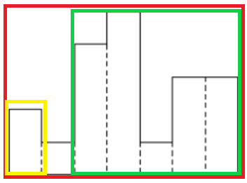

# 히스토그램(1725)

생성자: 두열 김
생성 일시: 2024년 4월 7일 오후 7:58

## 문제

히스토그램에 대해서 알고 있는가? 히스토그램은 아래와 같은 막대그래프를 말한다.


각 칸의 간격은 일정하고, 높이는 어떤 정수로 주어진다. 위 그림의 경우 높이가 각각 2 1 4 5 1 3 3이다.

이러한 히스토그램의 내부에 가장 넓이가 큰 직사각형을 그리려고 한다. 아래 그림의 빗금 친 부분이 그 예이다. 이 직사각형의 밑변은 항상 히스토그램의 아랫변에 평행하게 그려져야 한다.


주어진 히스토그램에 대해, 가장 큰 직사각형의 넓이를 구하는 프로그램을 작성하시오.

## 입력

첫 행에는 N (1 ≤ N ≤ 100,000) 이 주어진다. N은 히스토그램의 가로 칸의 수이다. 다음 N 행에 걸쳐 각 칸의 높이가 왼쪽에서부터 차례대로 주어진다. 각 칸의 높이는 1,000,000,000보다 작거나 같은 자연수 또는 0이다.

## 출력

첫째 줄에 가장 큰 직사각형의 넓이를 출력한다. 이 값은 20억을 넘지 않는다.

## 시간 제한

0.7초

## 메모리 제한

128MB

## 나의 풀이

```java
import java.io.BufferedReader;
import java.io.IOException;
import java.io.InputStreamReader;

public class BOJ_1725 {

    private static int N;
    private static int[] arr;

    private static SegmentTree segmentTree;

    public static void main(String[] args) throws IOException {
        init();

        printAnswer();
    }

    private static void printAnswer() {
        System.out.println(getMaxArea(0, N - 1));
    }

    private static int getMaxArea(int left, int right) {
        int minIndex = segmentTree.minIndex(left, right);

        int area = arr[minIndex] * (right - left + 1);

        if (left < minIndex) {
            area = Math.max(area, getMaxArea(left, minIndex - 1));
        }

        if (right > minIndex) {
            area = Math.max(area, getMaxArea(minIndex + 1, right));
        }

        return area;
    }

    private static void init() throws IOException {
        BufferedReader br = new BufferedReader(new InputStreamReader(System.in));

        N = Integer.parseInt(br.readLine());

        arr = new int[N];
        for (int i = 0; i < N; i++) {
            arr[i] = Integer.parseInt(br.readLine());
        }

        segmentTree = new SegmentTree(arr);
    }

    private static class SegmentTree {

        private int[] arr;
        private int[] tree;

        public SegmentTree(int[] arr) {
            this.arr = arr;

            tree = new int[arr.length * 4];
            init(1, 0, arr.length - 1, arr);
        }

        private void init(int node, int start, int end, int[] arr) {
            if (start == end) {
                tree[node] = start;
                return;
            }

            int mid = (start + end) / 2;

            init(node * 2, start, mid, arr);
            init(node * 2 + 1, mid + 1, end, arr);

            if (arr[tree[node * 2]] < arr[tree[node * 2 + 1]]) {
                tree[node] = tree[node * 2];
            } else if (arr[tree[node * 2]] > arr[tree[node * 2 + 1]]) {
                tree[node] = tree[node * 2 + 1];
            } else {
                tree[node] = Math.min(tree[node * 2], tree[node * 2 + 1]);
            }
        }

        public int minIndex(int left, int right) {
            return minIndex(1, 0, arr.length - 1, left, right);
        }

        private int minIndex(int node, int start, int end, int left, int right) {
            if (right < start || left > end) {
                return -1;
            }

            if (left <= start && end <= right) {
                return tree[node];
            }

            int mid = (start + end) / 2;

            int idx1 = minIndex(node * 2, start, mid, left, right);
            int idx2 = minIndex(node * 2 + 1, mid + 1, end, left, right);

            if (idx1 == -1) {
                return idx2;
            }

            if (idx2 == -1) {
                return idx1;
            }

            return arr[idx1] <= arr[idx2] ? idx1 : idx2;
        }
    }
}

```

### 풀이 과정

1. 특정 구간에서 가장 큰 직사각형의 넓이는 `(구간 안 막대 그래프 중 높이의 최솟값) * (구간의 길이)`라는 사실을 알게 됨
2. 최솟값 세그먼트 트리를 이용해 풀이 시작
3. 특정 구간에서 가장 큰 직사각형의 넓이를 구할 수는 있게 되었지만, 전체 그래프에서 가장 큰 직사각형은 구할 수 없었음. (시간 초과)
4. 최소 인덱스 세그먼트 트리로 변경
5. 최솟값을 가지는 인덱스 기준으로 왼쪽 구간, 오른쪽 구간으로 나눈 후, 전체 구간, 왼쪽 구간, 오른쪽 구간에서 각각 그려지는 가장 큰 직사각형 중 제일 큰 직사각형의 넓이를 구하기(재귀)

